## The 20 diagrams AI can build
A working reference for engineers, architects, PMs, and technical writers. Five use-case groups, twenty diagram types, one running example - Orderly, a fictional e-commerce order platform. Every card gives you the decision rule, the risk, a rendered Mermaid preview, and ready-to-paste prompts for Mermaid.js and PlantUML.

## Start here
Use this guide as a working template, not a notation encyclopedia. Pick the communication job first, then choose the diagram that makes the system easiest to understand.

- **Best for:** engineers, architects, PMs, technical writers, and operators who need architecture diagrams without starting from a blank canvas.
- **Output:** One readable diagram per architecture question, plus prompts you can paste into Mermaid, PlantUML, or an AI coding assistant.
- **Template:** Question, when to use it, when to avoid it, rendered example, then implementation prompts.

## How each card works
Every diagram follows the same structure so you can scan fast:

1. **Decision label:** The job the diagram does.
2. **Orderly question:** The architecture question it answers.
3. **Use when:** The situation where this diagram is the clearest option.
4. **Avoid when:** The common misuse that makes the diagram misleading.
5. **Rendered example and prompt starter:** A diagram preview plus Mermaid and PlantUML prompts.

## Scenario: Orderly launch
Orderly is a new e-commerce platform going live in six weeks. One team of six, three backend services, a web UI, Stripe for payments, Shippo for shipping labels. Every diagram in this guide describes a different facet of the same system so you can see how each diagram's lens differs from the next.
- **Team:** 6 people.
- **Services:** Order, Payment, Inventory.
- **Stack:** React, Node, Go, Postgres, Kafka, AWS EKS.
- **Vendors:** Stripe, Shippo, Segment.

## Quick-pick map
- **Structure:** Class, Component, Deployment, ERD.
- **Behavior:** Flowchart, Sequence, State, Use Case.
- **Hierarchy:** Mind Map, Org Chart, WBS, JSON Tree.
- **Time:** Gantt, Timeline, User Journey, Git Graph.
- **Flow and context:** C4 Context, BPMN, Network, Sankey.

## Group 1 - What is this system made of?
Static structure. The shapes, parts, and relationships that exist whether anyone is using the system or not.

### 01 / OBJECT STRUCTURE - Class Diagram
> **Orderly question:** What objects make up our codebase and how do they relate?
**Use when:** Modeling OO code: classes, fields, methods, relationships. Onboarding new engineers to the domain model.
**Avoid when:** Audience isn't technical - use a context diagram. You have 40+ classes - show the subsystem only.

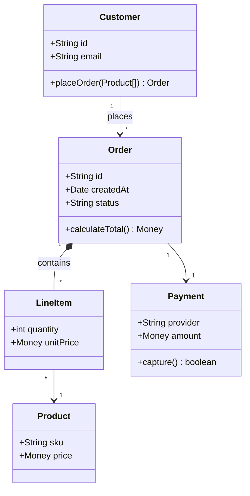

**Prompt starter:**
```text
Mermaid prompt: "Build a Mermaid classDiagram for Orderly's core domain: Customer, Order, LineItem, Product, Payment. Show fields and methods. Include multiplicities and aggregation/composition where appropriate."
```
```text
PlantUML prompt: "Generate PlantUML @startuml class diagram for Orderly's core domain (Customer, Order, LineItem, Product, Payment). Use UML composition (*--) where an Order owns its LineItems, association (-->) otherwise. Include visibility markers."
```

### 02 / LOGICAL COMPONENTS - Component Diagram
> **Orderly question:** What are the major moving parts of the system and how do they connect?
**Use when:** Showing logical modules and their connections. Architecture review / ADR supporting diagram.
**Avoid when:** Audience needs physical runtime info - use Deployment. Mixing class-level detail with component-level detail.

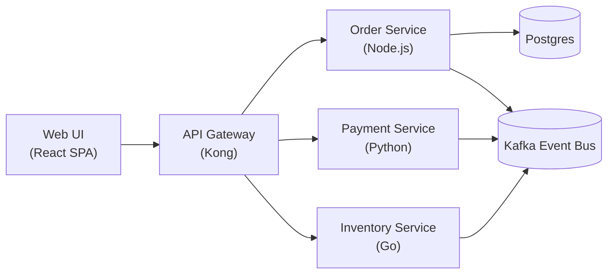

**Prompt starter:**
```text
Mermaid prompt: "Build a Mermaid flowchart LR that approximates a UML component diagram for Orderly: Web UI, API Gateway, Order/Payment/Inventory services, Kafka event bus, Postgres. Use rectangles for services and cylinders/stadia for stores."
```
```text
PlantUML prompt: "Generate PlantUML @startuml component diagram with package boundaries for Orderly. Use [component] syntax, ()interfaces, and show the Kafka bus + Postgres as databases."
```

### 03 / RUNTIME / PHYSICAL - Deployment Diagram
> **Orderly question:** Where do these services actually run in production?
**Use when:** Documenting cloud / on-prem topology. SRE, ops, and security reviews.
**Avoid when:** Audience doesn't care about infra - use Component. Secrets / IPs would need to be on the image.

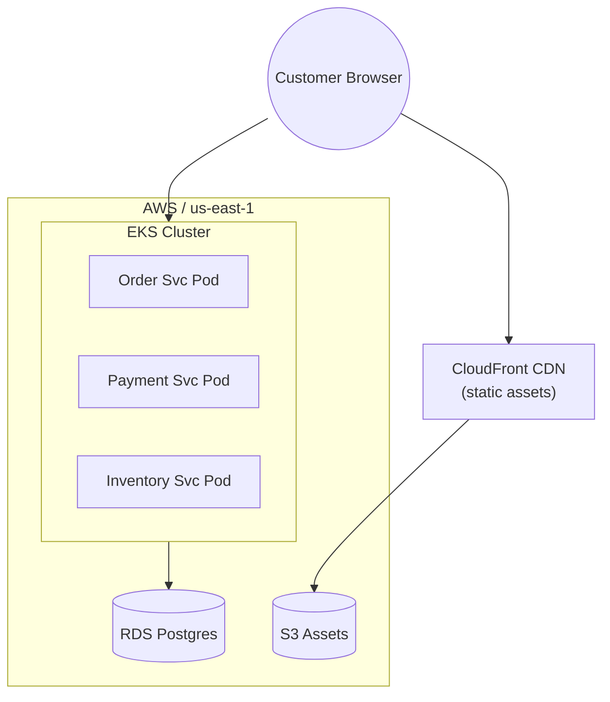

**Prompt starter:**
```text
Mermaid prompt: "Build a Mermaid flowchart TB approximating a UML deployment diagram for Orderly: CloudFront, EKS cluster with 3 service pods, RDS Postgres, S3. Group AWS resources in a subgraph."
```
```text
PlantUML prompt: "Generate PlantUML @startuml deployment diagram with proper node + artifact stereotypes for Orderly on AWS. Show EKS node containing three pod artifacts, RDS database, CloudFront edge, S3 bucket."
```

### 04 / DATA SCHEMA - Entity-Relationship Diagram
> **Orderly question:** What does the database schema look like, and how do the tables connect?
**Use when:** Designing or documenting a relational schema. Reviewing referential integrity and cardinality.
**Avoid when:** Modeling a document/graph store - use a schema sample instead. You need behavior, not shape - use Sequence/State.

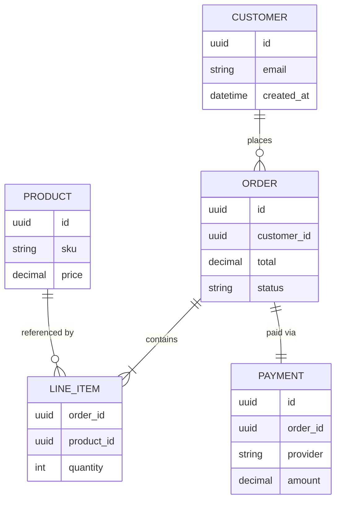

**Prompt starter:**
```text
Mermaid prompt: "Build a Mermaid erDiagram for Orderly with CUSTOMER, ORDER, LINE_ITEM, PRODUCT, PAYMENT. Use crow's-foot cardinality. Include column types (uuid, string, decimal, datetime)."
```
```text
PlantUML prompt: "Generate PlantUML @startuml ERD using 'entity' blocks with PK/FK markers for Orderly's five core tables. Include cardinality and NOT NULL hints."
```

## Group 2 - What does it DO, step by step?
Dynamic behavior. How the system executes over time: logic branches, message exchange, state transitions, and who triggers what.

### 05 / STEP-BY-STEP LOGIC - Flowchart / Activity Diagram
> **Orderly question:** What's the checkout flow, with its branches and guards?
**Use when:** Describing a process with decisions and branches. Walking non-engineers through business logic.
**Avoid when:** Actions happen concurrently across actors - use Sequence or BPMN. Diagram sprawls past one screen.

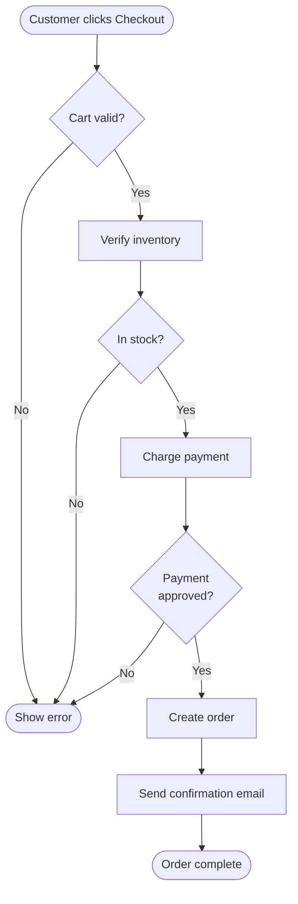

**Prompt starter:**
```text
Mermaid prompt: "Build a Mermaid flowchart TD of Orderly's checkout flow. Rounded start/end, rectangles for actions, rhombus for decisions. Include three failure branches converging to a single error end."
```
```text
PlantUML prompt: "Generate PlantUML @startuml activity diagram (new syntax, using:action;) for Orderly's checkout flow. Use if/else blocks for guards and stop for failure branches."
```

### 06 / MESSAGES OVER TIME - Sequence Diagram
> **Orderly question:** In what order do our services exchange messages during a checkout?
**Use when:** Showing precise order of messages across actors/services. Designing or reviewing APIs and protocols.
**Avoid when:** There are 10+ participants - split or pick a slice. Flow is branchy - use a flowchart.

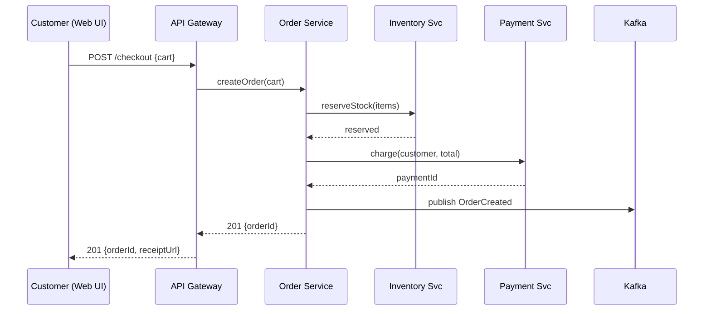

**Prompt starter:**
```text
Mermaid prompt: "Build a Mermaid sequenceDiagram for Orderly's checkout across Customer, API Gateway, Order, Inventory, Payment services and Kafka. Use solid arrows for calls and dashed for responses. Include an emitted OrderCreated event."
```
```text
PlantUML prompt: "Generate PlantUML @startuml sequence diagram of Orderly's checkout. Use 'actor Customer' and 'participant' for services. Include activation bars and return arrows. Add a note about idempotency key."
```

### 07 / STATES & TRANSITIONS - State Diagram
> **Orderly question:** What states can an Order be in, and what events move it between them?
**Use when:** An entity has a finite lifecycle (order, subscription, ticket). You want every legal transition in one picture.
**Avoid when:** The entity has 20+ states - group them into regions. Transitions are mostly time-based - use a timeline instead.

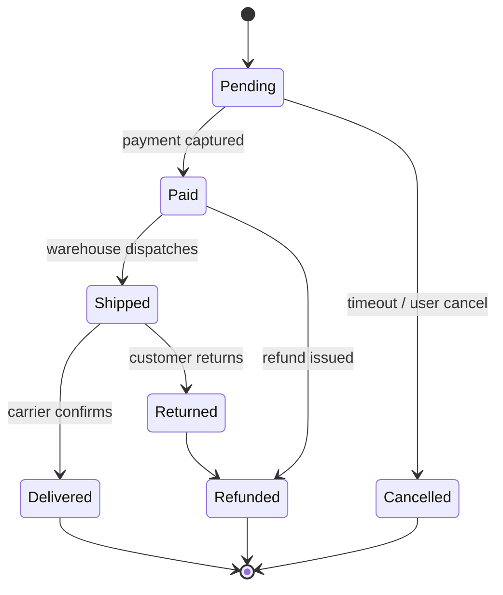

**Prompt starter:**
```text
Mermaid prompt: "Build a Mermaid stateDiagram-v2 for an Orderly Order's lifecycle: Pending, Paid, Shipped, Delivered, Cancelled, Refunded, Returned. Include an entry state and end states. Label each transition with its trigger."
```
```text
PlantUML prompt: "Generate PlantUML @startuml state diagram with [*] initial/final nodes, entry/exit actions where useful, and a 'Returned' substate inside 'Delivered' as a nested region if appropriate."
```

### 08 / ACTORS & GOALS - Use Case Diagram
> **Orderly question:** Who uses the system and what are they trying to accomplish?
**Use when:** Agreeing on scope with stakeholders at kickoff. Mapping actors to goals before writing stories.
**Avoid when:** You need the HOW - use Flowchart / Sequence. You're tempted to use <<include>> everywhere - simplify.

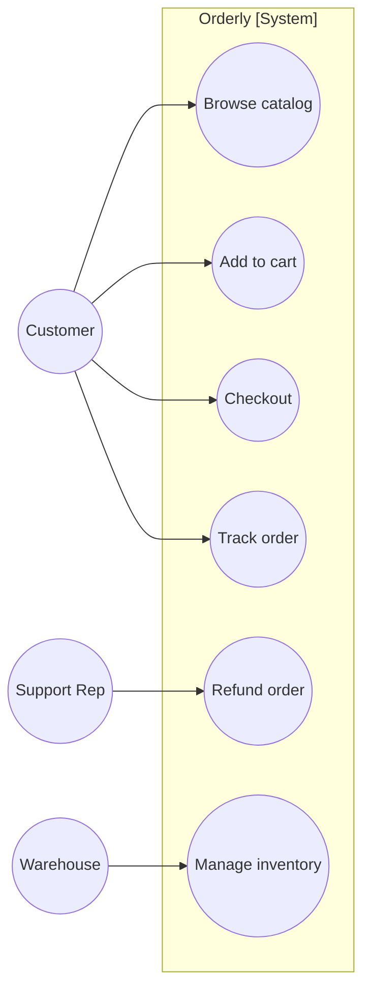

**Prompt starter:**
```text
Mermaid prompt: "Build a Mermaid flowchart LR that approximates a UML use case diagram for Orderly. Render actors as stick-figure circles, use cases as ellipses inside a 'system' subgraph. Keep goals verb-phrased."
```
```text
PlantUML prompt: "Generate PlantUML @startuml use case diagram for Orderly. Use 'actor' and '(Use Case)' syntax inside a rectangle 'Orderly'. Include <<extend>> from 'Refund order' to 'Checkout' if appropriate."
```

## Group 3 - How are these concepts related?
Tree-shaped information. Parents and children, whole and parts, scopes and sub-scopes.

### 09 / CONCEPT HIERARCHY - Mind Map
> **Orderly question:** What does a brainstorm of v1 features look like, before we prioritize?
**Use when:** Brainstorming before structure is locked. Kickoff sessions and scoping workshops.
**Avoid when:** The structure is truly a DAG - use a flowchart. Leaves need data/properties - use a tree table.

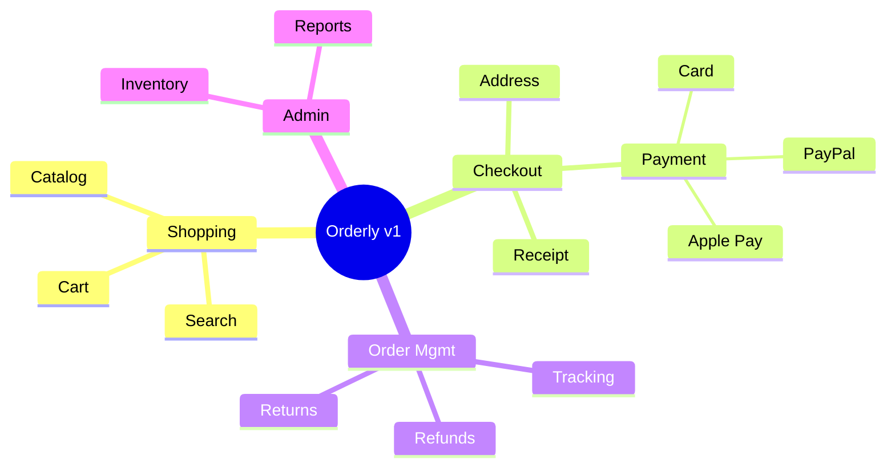

**Prompt starter:**
```text
Mermaid prompt: "Build a Mermaid mindmap with root 'Orderly v1' and four branches (Shopping, Checkout, Order Mgmt, Admin), each with 3-4 sub-leaves. Use the double-paren circle shape for the root."
```
```text
PlantUML prompt: "Generate PlantUML @startmindmap for Orderly v1. Use '+' for right-side branches. Keep depth to 3 levels max."
```

### 10 / REPORTING TREE - Org Chart
> **Orderly question:** Who reports to whom on the launch team?
**Use when:** Showing reporting lines or escalation paths. RACI / team-topology handoffs.
**Avoid when:** People have multiple managers - shape is a graph, not a tree. Org changes every week - diagram goes stale fast.

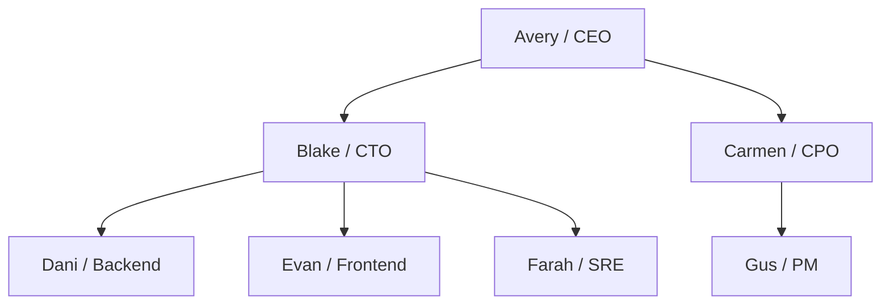

**Prompt starter:**
```text
Mermaid prompt: "Build a Mermaid flowchart TD representing Orderly's 7-person org chart. Top: CEO. Direct reports: CTO, CPO. Under CTO: 3 engineers. Under CPO: 1 PM. Label each node with name + title."
```
```text
PlantUML prompt: "Generate PlantUML @startwbs (work breakdown syntax) or @startuml class diagram repurposed as an org chart. Use the 'person' stereotype and simple rectangles."
```

### 11 / WORK BREAKDOWN - Work Breakdown Structure (WBS)
> **Orderly question:** How do we decompose the 6-week launch into deliverables?
**Use when:** Program planning - decomposing scope into packages. Estimation and ownership assignment.
**Avoid when:** You're tracking progress - use Gantt or Kanban. Scope is still exploratory - use Mind Map.

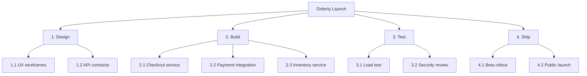

**Prompt starter:**
```text
Mermaid prompt: "Build a Mermaid flowchart TD acting as a WBS. Root is 'Orderly Launch'. Four level-1 packages (Design, Build, Test, Ship). Each has 2-3 level-2 deliverables. Use WBS numbering (1.1, 2.1, etc.)."
```
```text
PlantUML prompt: "Generate PlantUML @startwbs for Orderly's 6-week launch. Use '+' for right-side children, '-' for left. Keep to 2 levels of depth."
```

### 12 / PAYLOAD / CONFIG SHAPE - JSON / YAML Tree
> **Orderly question:** What's the shape of the GET /orders/:id response payload?
**Use when:** Documenting API responses / config files at a glance. Spotting structural issues before writing code.
**Avoid when:** Schema has 100+ fields - use a schema file directly. Readers need exact types - attach the OpenAPI / JSON Schema.

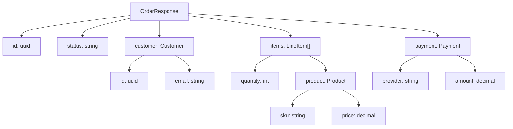

**Prompt starter:**
```text
Mermaid prompt: "Build a Mermaid flowchart TD tree representing the JSON shape of Orderly's GET /orders/:id response (OrderResponse). Each node is 'key: type'. Nest objects and arrays."
```
```text
PlantUML prompt: "Generate PlantUML @startjson showing the OrderResponse payload. Use the json block syntax, include nested customer, items (array), and payment."
```

## Group 4 - When does each thing happen?
Time-ordered diagrams. Scheduling, milestones, progression, and commits.

### 13 / PROJECT SCHEDULE - Gantt Chart
> **Orderly question:** What's the 6-week launch schedule, and where are the dependencies?
**Use when:** Project schedule with tasks, durations, and dependencies. Sharing a timeline with stakeholders.
**Avoid when:** Actual work is pull-based - use Kanban. Dates shift daily - diagram becomes a lie.

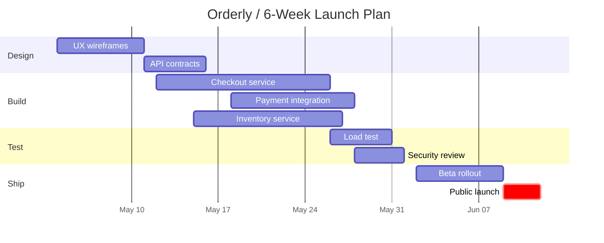

**Prompt starter:**
```text
Mermaid prompt: "Build a Mermaid gantt for Orderly's 6-week launch. Four sections (Design, Build, Test, Ship). Include an 'after' dependency and mark the public launch 'crit'."
```
```text
PlantUML prompt: "Generate PlantUML @startgantt for Orderly's 6-week launch. Define project start, tasks with durations, 'happens after' dependencies, and a red-colored critical path."
```

### 14 / EVENT SEQUENCE - Timeline
> **Orderly question:** What's the story of the company from idea to launch?
**Use when:** Telling the story of a project, company, or incident. Retro docs and all-hands slides.
**Avoid when:** You need durations and overlaps - use Gantt. Events have precise times/ordering across actors - use Sequence.

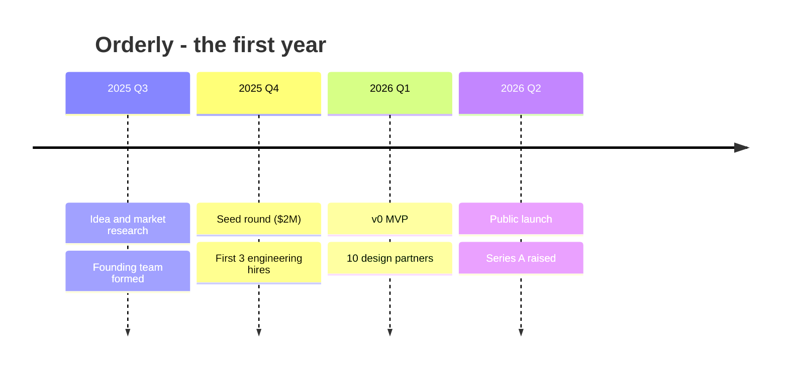

**Prompt starter:**
```text
Mermaid prompt: "Build a Mermaid timeline titled 'Orderly - the first year'. Four periods (2025 Q3, Q4, 2026 Q1, Q2) each with 2 bullet events."
```
```text
PlantUML prompt: "Generate PlantUML @startuml horizontal timeline using 'concise' participants or the 'robust' timing diagram style. Keep to 4 periods and 8 events total."
```

### 15 / PERSONA / SATISFACTION - User Journey
> **Orderly question:** How does a first-time customer feel at each step of their first order?
**Use when:** UX research - surfacing friction points. Prioritization by user emotion, not task count.
**Avoid when:** You haven't talked to real users - the scores are fiction. You need system behavior - use Flowchart or Sequence.

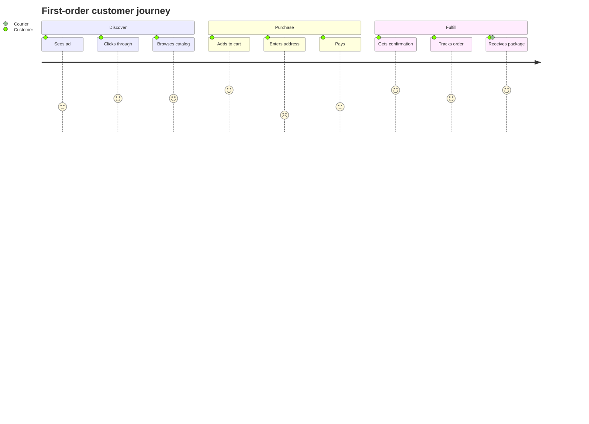

**Prompt starter:**
```text
Mermaid prompt: "Build a Mermaid journey titled 'First-order customer journey' with three sections (Discover, Purchase, Fulfill). Each action scored 1-5 with actor(s) after the colon."
```
```text
PlantUML prompt: "Generate PlantUML salt / customjourney style approximation - actually a colored horizontal Gantt with emoji/satisfaction column would work. Or recommend that Mermaid is the better tool here."
```

### 16 / BRANCH / MERGE - Git Graph
> **Orderly question:** What branching model are we using for the launch?
**Use when:** Explaining a branching model (GitFlow, trunk-based, release branches). Documenting a release cut for auditors.
**Avoid when:** You just need a list of commits - use git log. Branches are too many - show a subset.

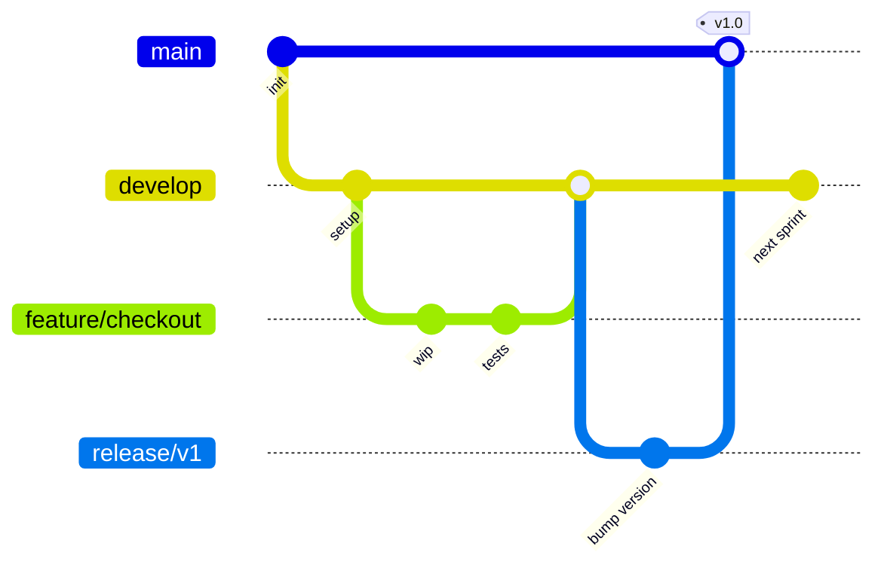

**Prompt starter:**
```text
Mermaid prompt: "Build a Mermaid gitGraph showing Orderly's branching: main, develop, a feature/checkout branch, and a release/v1 branch. Include a merge into main and a v1.0 tag."
```
```text
PlantUML prompt: "Generate PlantUML @startuml approximation of a git branch graph using the 'rectangle' and arrow syntax, labeling each branch and tag. Or recommend Mermaid as the native tool."
```

## Group 5 - Who talks to whom, where does this fit?
Systems in context. Where the thing you're building sits relative to the rest of the world, and how volume flows between parts.

### 17 / SYSTEM IN ITS WORLD - C4 Context Diagram
> **Orderly question:** How does Orderly fit into its wider ecosystem - users, systems, and third parties?
**Use when:** First diagram in any architecture doc - frames the world. Explaining to non-engineers where the system sits.
**Avoid when:** You need internal detail - use Container/Component (C4 levels 2-3). You have no external actors - a component diagram is enough.

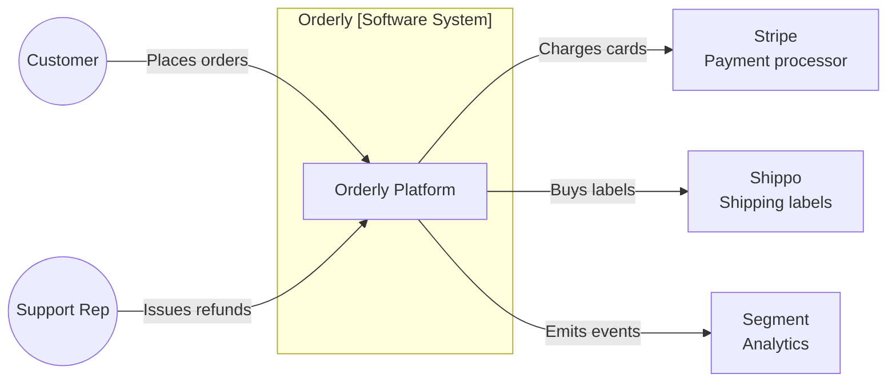

**Prompt starter:**
```text
Mermaid prompt: "Build a Mermaid flowchart LR approximating a C4 System Context diagram for Orderly. One central 'Orderly Platform' box, two person actors (Customer, Support Rep), three external systems (Stripe, Shippo, Segment). Label every arrow with the interaction."
```
```text
PlantUML prompt: "Generate PlantUML using the C4-PlantUML library (include!include https..C4_Context.puml). Use Person(), System(), System_Ext() and Rel() for the relationships. Keep arrows labeled."
```

### 18 / BUSINESS PROCESS - BPMN
> **Orderly question:** What's the end-to-end fulfillment process across customer, warehouse, and carrier?
**Use when:** Business-process docs spanning multiple departments. Auditors or BAs who read BPMN natively.
**Avoid when:** Audience is all engineering - a Sequence is simpler. You don't need the exact BPMN shapes - use swim-lane flowchart.

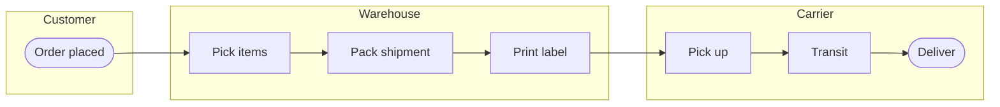

**Prompt starter:**
```text
Mermaid prompt: "Build a Mermaid flowchart LR with three 'swim-lane' subgraphs (Customer, Warehouse, Carrier) for Orderly fulfillment. Rounded start/end, rectangles for tasks."
```
```text
PlantUML prompt: "Generate PlantUML @startuml activity diagram with |lane| syntax for three lanes (Customer, Warehouse, Carrier). Use the new:task syntax and:end: to close the flow."
```

### 19 / NETWORK TOPOLOGY - Network Diagram
> **Orderly question:** How is our production network laid out - subnets, gateways, tiers?
**Use when:** Network review, security assessment, VPC documentation. Onboarding SREs to the topology.
**Avoid when:** You really need packet-level flow - use a sequence or DFD. Logical architecture is enough - use Component.

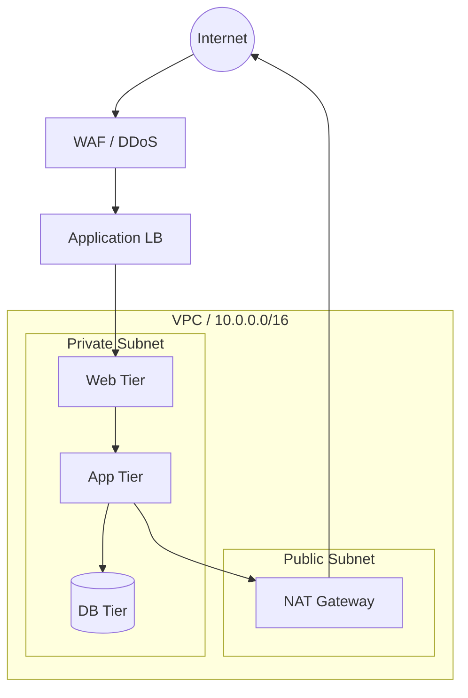

**Prompt starter:**
```text
Mermaid prompt: "Build a Mermaid flowchart TB network diagram for Orderly: Internet -> WAF -> LB, nested VPC subgraph with public subnet (NAT) and private subnet (Web, App, DB tiers). Show egress via NAT to Internet."
```
```text
PlantUML prompt: "Generate PlantUML @startuml using 'nwdiag' or standard boxes to show the VPC, public/private subnets, tiers, WAF, LB, and NAT. Use CIDR annotations."
```

### 20 / FLOW VOLUME - Sankey Diagram
> **Orderly question:** Where does traffic enter the funnel and where does it leak out?
**Use when:** Showing volume flowing and splitting between nodes. Funnel analysis, attribution, cost flows.
**Avoid when:** Two tiny stages - a funnel chart is cleaner. There's no shared substance flowing - use a flowchart.

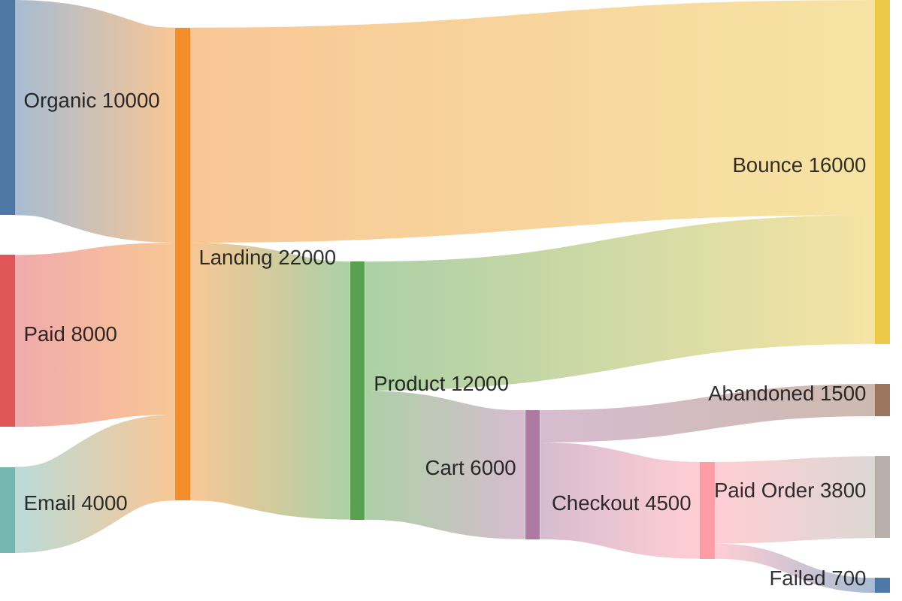

**Prompt starter:**
```text
Mermaid prompt: "Build a Mermaid sankey-beta for Orderly's funnel: three sources (Organic, Paid, Email) into Landing, then into Product/Bounce, then Cart/Checkout/Paid Order, with leak outs at each stage."
```
```text
PlantUML prompt: "PlantUML has no native Sankey - recommend Mermaid for Sankey, or generate a matplotlib/plotly script. Optionally produce an ASCII approximation."
```

## How to use this guide
Ask the model for one diagram at a time. Name the audience, the system boundary, the exact nodes, and the output format before asking for syntax.
